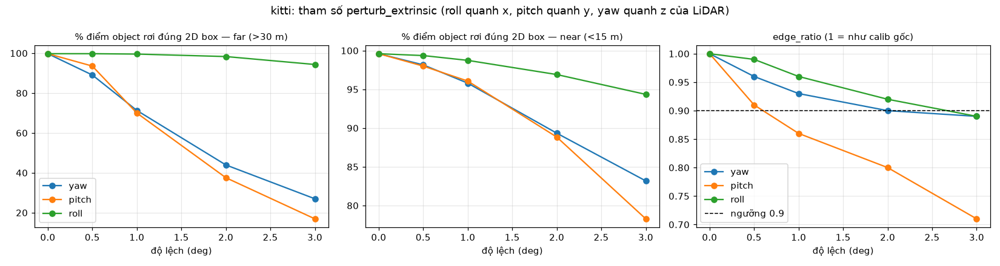
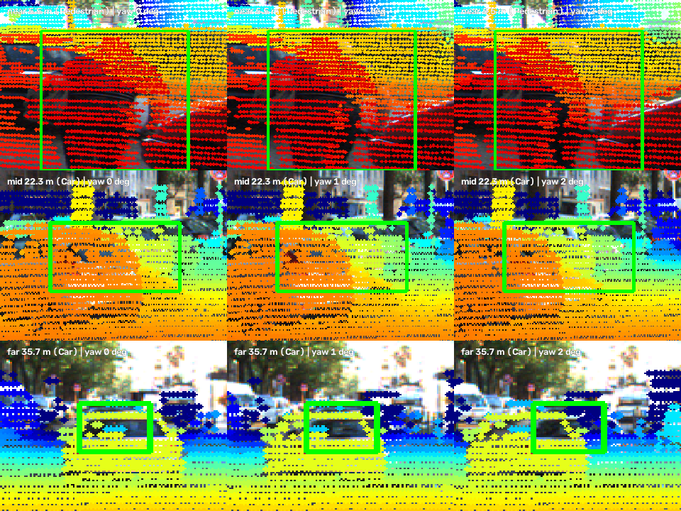
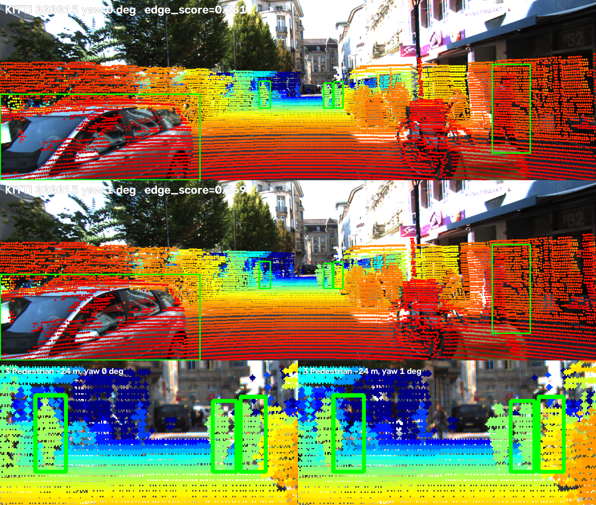
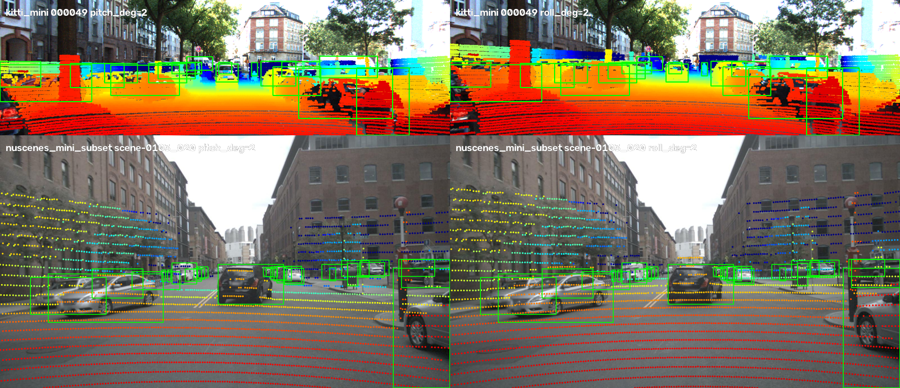

# Báo cáo Day 6: Calibration drift 1° — projection lệch khỏi object xa, edge score không bắt kịp

> Thay **mọi** ô có chữ ĐIỀN nằm trong ngoặc vuông bằng nội dung của bạn, xoá luôn cả dấu ngoặc vuông. Lệnh `python tools/check_submission.py` sẽ báo FAIL nếu còn sót bất kỳ chỗ nào.

- **Họ tên:** Võ Minh Quân
- **MSSV:** 2A202602429
- **Lớp:** Track04
- **Link repo:** https://github.com/vminhquan/VoMinhQuan-2A202602429-Track4-Day21.git
- **Topic:** A — LiDAR-camera projection QA
- **Dataset:** data/kitti_mini, data/nuscenes_mini_subset, data/synthetic (chỉ để test CP2)
- **Các frame đã dùng:** kitti_mini: cả 20 frame (000001 … 000061); nuScenes: 20 frame, cứ 4 keyframe lấy 1 (scene-0103_000, _004, …, _036 và scene-1094_000, _004, …, _036); synthetic: 000000

> Hãy viết ngắn: mỗi mục từ 3 đến 8 dòng, ưu tiên số liệu và hình ảnh.

## 1. Claim

Trên 20 frame KITTI, lệch **yaw 1°** (≈ 12.6 px ngang, vì f = 721.5 px) làm tỉ lệ điểm LiDAR của object rơi đúng vào 2D box giảm từ 99.8% xuống **71.3% với object xa > 30 m**, nhưng chỉ xuống 95.8% với object gần < 15 m. Edge-alignment score (ngưỡng 0.9 so với calib gốc) chỉ phát hiện drift ở **25% frame với yaw 1°** và 65% frame với pitch 1°. Vì vậy, chỉ dùng score của một frame thì không đủ để cảnh báo drift 1°.

## 2. Evidence

Thí nghiệm: mỗi lần chỉ thay đổi 1 yếu tố trong `perturb_extrinsic` (yaw/pitch/roll 0.5–3°, tịnh tiến 2–10 cm), giữ nguyên ảnh, point cloud và label. Code: `src/calib_drift.py`. Không có bước ngẫu nhiên: chạy lại cho ra file CSV giống hệt từng byte (đã kiểm tra bằng `cmp`).
- **in_box:** chọn điểm nằm trong 3D box GT và nhìn thấy được với calib gốc (106 object, 37 954 điểm), rồi tính % điểm vẫn rơi vào 2D box của chính object đó sau khi perturb.
- **edge_ratio:** edge score sau perturb chia cho edge score của calib gốc. Edge score = trung bình `exp(-d/3px)`, với d là khoảng cách (pixel) từ điểm biên depth đến cạnh Canny gần nhất.
- **detect:** % frame có `edge_ratio < 0.9`.

**KITTI (20 frame)**: `results/drift_kitti_summary.csv`, từng frame trong `results/drift_kitti.csv`

| Cấu hình | inside FOV % | in_box near (<15 m) % | in_box mid (15–30 m) % | in_box far (>30 m) % | edge_ratio | detect % |
|---|---|---|---|---|---|---|
| baseline | 15.75 | 99.6 | 99.5 | 99.8 | 1.000 | 0 |
| yaw 0.5° | 15.76 | 98.2 | 96.0 | 89.1 | 0.957 | 5 |
| yaw 1° | 15.76 | 95.8 | 88.8 | 71.3 | 0.927 | 25 |
| yaw 2° | 15.77 | 89.3 | 76.9 | 43.9 | 0.899 | 45 |
| yaw 3° | 15.77 | 83.2 | 65.8 | 27.0 | 0.891 | 45 |
| pitch 1° | 15.02 | 96.1 | 93.4 | 70.0 | 0.864 | 65 |
| pitch 3° | 13.50 | 78.3 | 58.8 | 16.9 | 0.714 | 95 |
| roll 1° | 15.76 | 98.7 | 98.1 | 99.6 | 0.959 | 25 |
| roll 3° | 15.79 | 94.3 | 91.1 | 94.3 | 0.892 | 35 |
| ty 10 cm (ngang) | 15.76 | 97.7 | 98.4 | 98.9 | 0.980 | 0 |
| tz 10 cm (đứng) | 16.48 | 97.0 | 98.0 | 97.6 | 0.968 | 15 |

**Nhận xét:**
- **inside FOV % gần như không đổi theo yaw**, nên metric này không dùng được để phát hiện drift.
- **Lệch góc làm pixel dịch một lượng cố định** (`f·tanθ`), không phụ thuộc khoảng cách. Object xa trông nhỏ trên ảnh, nên cùng một độ dịch đã đẩy phần lớn điểm của nó ra ngoài box.
- **Tịnh tiến 10 cm làm pixel dịch `f·t/z`**, chỉ khoảng 3 px ở 24 m, nên ảnh hưởng nhỏ.




*Ảnh 3 khoảng cách (5.5 / 22.3 / 35.7 m, frame 000049), cột là yaw 0°, 1°, 2°. Overlay toàn khung: `results/figures/demo_overlay_000049.png`.*

**So sánh với nuScenes (20 frame)**: `results/drift_nuscenes_summary.csv`, ảnh `results/figures/drift_plot_nuscenes.png`

| Cấu hình | KITTI in_box (all) % | nuScenes in_box (all) % | KITTI detect % | nuScenes detect % |
|---|---|---|---|---|
| yaw 1° | 93.0 | 95.8 | 25 | 55 |
| yaw 3° | 76.5 | 77.7 | 45 | 55 |
| `pitch_deg` 3° | 70.9 | 95.8 | 95 | 30 |
| `roll_deg` 3° | 93.5 | 72.3 | 35 | 70 |
| `ty` 10 cm | 98.0 | 100.0 | 0 | 0 |

**Vì sao hai dataset khác nhau:**
1. **Trục LiDAR khác nhau.** nuScenes có x hướng sang phải và y hướng về trước. Vì vậy `pitch_deg` và `roll_deg` đổi vai trò cho nhau, và `ty` thành dịch về phía trước nên gần như không có tác dụng (xem mục 3, case 2).
2. **Edge score của nuScenes nhiễu.** LiDAR 32 beam chỉ cho trung vị 170 điểm biên/frame, so với 1 779 điểm của KITTI (dù đã dùng `--edge-kernel 21`). Kết quả là tỉ lệ phát hiện không tăng đều theo mức lệch: yaw 2° chỉ 30%, trong khi yaw 1° là 55%.
3. **Ảnh nuScenes có độ phân giải cao hơn** (f = 1 253 px). Yaw 1° làm pixel dịch khoảng 22 px, nhưng object cũng chiếm nhiều pixel hơn, nên in_box tổng giảm tương đương KITTI.
4. **Mẫu object xa của nuScenes rất ít**: chỉ 161 điểm > 30 m. Cột far của nuScenes vì vậy không đủ tin cậy.

## 3. Failure case



**Case 1, lớp Metric: edge score không thấy drift yaw 1° ở KITTI 000015.**
- **Hiện tượng:** edge score chỉ giảm 0.581 → 0.569 (ratio 0.979, không vượt ngưỡng). Trong khi đó, điểm LiDAR của 3 Pedestrian ở ~24 m chỉ còn 0%, 9% và 25% rơi trong box (hàng dưới của ảnh). Tính trên toàn bộ object mid của frame, in_box còn 12.1%.
- **Nguyên nhân gốc:** score lấy trung bình trên khoảng 2 900 điểm biên của cả ảnh. Phần lớn số điểm đó nằm ở tường nhà, cây và xe gần. Những vùng này có nhiều texture nên cạnh Canny dày đặc, và khi bị dịch 12 px thì điểm vẫn nằm gần một cạnh nào đó. Người đi bộ ở xa chỉ đóng góp vài chục điểm, nên gần như không làm score thay đổi.
- **Liên hệ cảm biến:** lỗi góc gây ra độ dịch pixel cố định, nên object nhỏ và ở xa (chính là thứ ADAS cần thấy sớm) bị ảnh hưởng nặng nhất, nhưng lại đóng góp ít nhất vào score.
- **Cách phát hiện khi chạy thật:** cộng dồn score qua nhiều frame thay vì xét từng frame. Đánh trọng số cho điểm biên theo khoảng cách, hoặc chỉ tính trong box của detector 2D. Theo dõi thêm metric "% điểm LiDAR trong box detection 2D".



**Case 2, lớp Geometry: cùng tham số nhưng trục vật lý khác nhau.**
- **Hiện tượng:** với `pitch_deg=3`, in_box của KITTI giảm còn 70.9%, còn nuScenes vẫn ở 95.8%. Với `roll_deg=3` thì ngược lại.
- **Nguyên nhân:** `perturb_extrinsic` xoay quanh trục x/y/z của chính LiDAR. Trục x là "phía trước" chỉ đúng với KITTI; với nuScenes, x là "sang phải". Người đọc tưởng đang thử pitch, nhưng thực ra đang thử roll.
- **Cách phát hiện:** khai báo quy ước trục trong metadata calibration. Viết unit test: xoay 1° rồi kiểm tra pixel dịch theo đúng chiều mong đợi (yaw → u dịch, pitch → v dịch).

## 4. Khuyến nghị nếu triển khai thật

**Use-case:** ADAS trên xe, kết hợp LiDAR và camera để fusion phát hiện người đi bộ. Bracket gắn cảm biến có thể bị lệch sau va chạm nhẹ hoặc do rung.

- **Kết luận từ số liệu:** lệch 1° đã làm mất khoảng 29% điểm LiDAR trên object > 30 m (KITTI). Fusion có thể gán sai depth cho người đi bộ ở xa đúng vào lúc cần phanh sớm.
- **Trade-off của edge score:** rẻ, không cần target hay model, nhưng nhạy với texture. Nhạy với pitch (65% frame ở 1°) hơn yaw và roll (25%). Tịnh tiến ≤ 10 cm gần như không phát hiện được. Bù lại, tịnh tiến cỡ đó cũng ít ảnh hưởng projection: in_box ≥ 97%.
- **Đề xuất:**
  1. Theo dõi online bằng rolling mean của edge_ratio trên N frame, kết hợp % điểm LiDAR nằm trong box của detector 2D theo từng bin khoảng cách.
  2. Khi vượt ngưỡng: hạ trọng số nhánh LiDAR trong fusion, phát cảnh báo, rồi lên lịch calibrate lại bằng target.
- **Chỉ số cần log:**
  - edge_score theo frame, kèm số điểm biên
  - in_box theo bin near/mid/far
  - inside_fov_pct
  - độ lệch timestamp LiDAR–camera
  - sự kiện va chạm hoặc rung từ IMU
- **Bước tiếp theo (chưa làm):**
  - Đo phân bố của score khi calib đúng qua nhiều frame liên tiếp, để chọn ngưỡng theo tỉ lệ false alarm thay vì chọn cứng 0.9.
  - Đo thời gian tính score trên phần cứng chạy trên xe.

## 5. Cách chạy lại

Các lệnh tái tạo lại toàn bộ kết quả từ repo sạch.

```bash
pip install -r requirements.txt

# CP2: demo projection (velo_to_cam + cam_to_image)
python -m starter.projection --data-root data/synthetic --frame 000000
python -m starter.projection --data-root data/kitti_mini --frame 000011
python -m starter.projection --data-root data/nuscenes_mini_subset --frame scene-0103_010

# CP3: thí nghiệm drift -> results/drift_*.csv và results/drift_*_summary.csv
python -m src.calib_drift --data-root data/kitti_mini --out results/drift_kitti.csv
python -m src.calib_drift --data-root data/nuscenes_mini_subset --stride 4 --edge-kernel 21 --out results/drift_nuscenes.csv

# CP3–CP4: biểu đồ, ảnh demo theo khoảng cách, ảnh failure -> results/figures/
python -m src.make_figures

python tools/check_submission.py
```

`python -m src.calib_drift --help` liệt kê các tham số: `--frames`, `--stride`, `--edge-kernel`, `--out`.

## 6. Khai báo sử dụng AI

Ghi rõ đã dùng công cụ AI nào, dùng vào việc gì, và bạn đã tự kiểm chứng kết quả đó bằng cách nào. Nếu không dùng AI, ghi "Không sử dụng". Xem quy định ở `RULES.md` mục 2.

| Công cụ | Dùng cho việc gì | Bạn đã kiểm chứng thế nào |
|---|---|---|
| Claude Code (Claude Opus 5.5) | Viết 2 hàm TODO trong `starter/projection.py` | Điểm `(10, 0, 0)` trên synthetic/000000 cho `z_cam = 9.727` và `(u, v) = (613.96, 175.01)`, khớp với CHECKPOINTS (≈ 9.73, ≈ (614, 175)). Điểm NaN và điểm nằm sau camera bị loại. Xem ảnh overlay KITTI 000011: điểm khớp lên xe, người, mặt đường |
| Claude Code (Claude Opus 5.5) | Viết `src/calib_drift.py`, `src/make_figures.py` | Baseline in_box ≈ 99.6–100% (đúng kỳ vọng khi calib không lệch). Chạy lại cho CSV giống hệt (`cmp`). Kiểm tra từng object của frame 000015 bằng tay (0% / 9% / 25%). Đối chiếu độ dịch 12.6 px với công thức `f·tan(1°)` |
| Claude Code (Claude Opus 5.5) | Soạn bản nháp REPORT từ các file CSV đã chạy | Mọi con số lấy từ `results/*_summary.csv`. Tự đọc lại và đối chiếu với file CSV |
